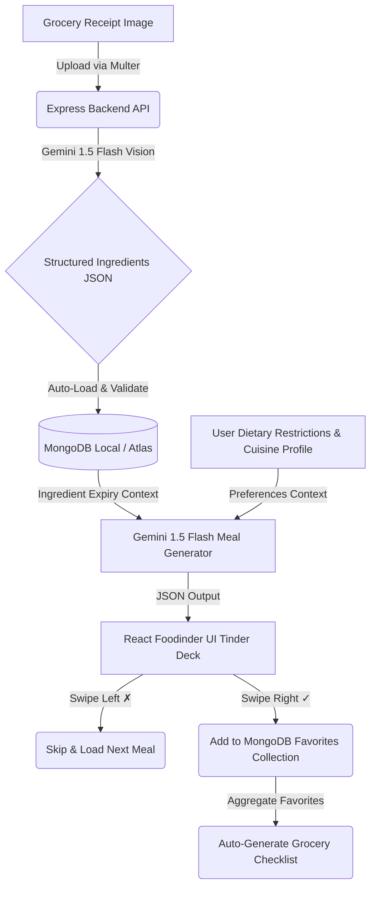

# 🧠 MenuMind
> **The Tinder-Style Gastronomic AI Matchmaker.** Match your current pantry ingredients with delicious recipes, swipe right to save, swipe left to pass, and automatically generate grocery lists from your favorite matches.

---

## 🎨 Project Showcase

```text
      __  __                  __  __ _           _ 
     |  \/  | ___ _ __  _   _|  \/  (_)_ __   __| |
     | |\/| |/ _ \ '_ \| | | | |\/| | | '_ \ / _` |
     | |  | |  __/ | | | |_| | |  | | | | | | (_| |
     |_|  |_|\___|_| |_|\__,_|_|  |_|_|_| |_|\__,_|
                                                    
```

MenuMind turns pantry management into an interactive experience. By scanning your grocery receipts, it extracts ingredients, tracks their expiration dates, and uses Gemini 1.5 Flash to recommend customized recipes based on what you have and your personal profile.

---

## 🔄 System Architecture & Data Flow

Below is the workflow showing how MenuMind processes user data from grocery receipts to culinary matches:



---

## 🚀 Feature Deep Dive

### 1. 🧾 Smart Receipt Scanner (OCR & Expiration Estimator)
*   **Gemini Vision Integration**: Upload image files (`.png`, `.jpg`) of shopping receipts. Gemini reads the receipt text and extracts the items.
*   **Intelligent Pantry Logging**: It parses the items, normalizes their names (e.g. converting store brand descriptions to basic food names), estimates their quantities, and predicts realistic expiration dates.
*   **Automatic Filters**: Non-edible items are automatically detected and omitted from the log.

### 2. 🍳 swipe-to-Match AI Recipe Deck
*   **Pantry-Strict Generation**: Suggests recipes utilizing the ingredients currently available in your database.
*   **Expiration Alert Routing**: Prioritizes ingredients closest to their expiration date so you minimize food waste.
*   **Portion Control**: Considers the remaining quantity of each item, keeping track of what is reserved for other meals.

### 3. ⚙️ Preferences Engine
Customize your matchmaking parameters:
*   **Cuisine Selection**: Italian, Mexican, Japanese, Indian, Nigerian, Slovenian, and more.
*   **Budget Tiers**: Filter recipes by Low, Medium, and High budget expectations.
*   **Cooking Time**: Choose Quick (<30m), Medium (30-60m), and Long (>60m) recipe preparation structures.
*   **Dietary Restrictions**: Choose multiple categories (e.g. Vegetarian, Vegan, Gluten-Free, Dairy-Free, Nut-Free) to prevent unsafe food suggestions.

### 4. 🛒 Dynamic Grocery Aggregator
*   When swiping right, liked meals are logged to your favorites table.
*   The Grocery page aggregates all liked meals, processes their required ingredients, and generates a normalized, clean grocery list so you know exactly what is missing and what you need to buy.

---

## 📂 Codebase Directory Map

```text
MenuMind/
├── backend/
│   ├── config/
│   │   ├── db.js                 # Database connection driver
│   │   └── geminiHelper.js       # Gemini 1.5 Flash client setup and JSON sanitization
│   ├── controllers/
│   │   ├── addNewFavMeal.js      # Appends swiped-right recipes to likes
│   │   ├── generateController.js # Handles inventory checks and meal recommendations
│   │   ├── generateGroceries.js  # Compiles grocery list from favorited meals
│   │   ├── receiptController.js  # Receipt upload, parsing, and inventory addition
│   │   └── profileController.js  # Gets/Sets user preference profile
│   ├── models/
│   │   ├── ingredientModel.js    # Schema for pantry ingredients (name, qty, dates)
│   │   ├── mealModel.js          # Schema for favorited recipes
│   │   └── profileModel.js       # Schema for user dietary profile
│   ├── routes/
│   │   ├── mealRoutes.js         # API endpoints for swipes, pantry, and receipts
│   │   └── profileRoutes.js      # API endpoints for settings
│   └── server.js                 # Entry file for the backend server (Port 8001)
├── frontend/
│   └── formula-hacks-app/        # React Web Application
│       ├── src/
│       │   ├── assets/           # UI graphics & fallback images
│       │   ├── api.js            # Base endpoint utility (routes to 8001)
│       │   ├── FoodCard.jsx      # Individual swipe card component
│       │   ├── FoodList.jsx      # Swiping deck layout and state manager
│       │   ├── MainPage.jsx      # Dashboard containing pantry tables and uploads
│       │   ├── Profile.jsx       # Settings page with preferences
│       │   └── groceries.jsx     # Aggregated shopping list table
├── package.json                  # Root backend scripts & metadata
└── README.md                     # Documentation
```

---

## 🔌 API Reference & Payload Specifications

### Meal Operations

#### `GET /meals/getIngredientsList`
*   **Description**: Fetch all logged pantry items.
*   **Response**: `200 OK`
    ```json
    [
      {
        "_id": "6a562c83743803669fec665b",
        "name": "Spinach",
        "quantity": 1,
        "start": "2026-07-14",
        "end": "2026-07-20"
      }
    ]
    ```

#### `POST /meals/addIngredient`
*   **Description**: Add an ingredient manually.
*   **Request Body**:
    ```json
    {
      "name": "Tomatoes",
      "quantity": 4,
      "start": "2026-07-14",
      "end": "2026-07-24"
    }
    ```

#### `GET /meals/makeMeals`
*   **Description**: Uses Gemini to suggest meals based on active ingredients.
*   **Response**: `200 OK`
    ```json
    [
      {
        "Meal": {
          "meal name": "Tomato Spinach Pasta",
          "ingredients": ["Tomatoes", "Spinach"]
        }
      }
    ]
    ```

#### `PUT /meals/parseReceipt`
*   **Description**: Process a receipt image (`multipart/form-data`) and load items into the pantry.
*   **Body Key**: `image` (File)

#### `PUT /meals/addMeal`
*   **Description**: Add a liked meal to favorites.
*   **Request Body**:
    ```json
    {
      "meal_name": "Tomato Spinach Pasta",
      "ingredients": "Tomatoes, Spinach"
    }
    ```

#### `GET /meals/makeGroceries`
*   **Description**: Create a grocery checklist based on all liked meals.

---

## 🛠️ Installation & Setup Guide

### 1. Configure the Environment
Create a `.env` file in the root directory:
```env
PORT=8001
MONGO_URI=mongodb://localhost:27017/menumind
GEMINI_API_KEY=YOUR_GEMINI_API_KEY
```

### 2. Install Packages
Execute package installations in the backend and frontend folders:
```bash
# Install backend dependencies
npm install

# Install frontend dependencies
cd frontend/formula-hacks-app
npm install
```

### 3. Run Applications
Start the backend Express server:
```bash
# Run from repository root
npm run dev
```

In a new terminal window, start the React application:
```bash
cd frontend/formula-hacks-app
npm start
```

The app will launch at `http://localhost:3000`.

---

## 🛡️ Applied Bug Fixes

To guarantee a stable, crash-free workflow, we audited and solved several issues:
*   **Upgraded `@google/generative-ai`**: Upgraded the client SDK to resolve outdated API endpoint formats, ensuring compatibility with `gemini-1.5-flash` model configurations.
*   **Port Coordination**: Routed the server to port **8001** and adjusted React's client configuration (`api.js`) to target port `8001` to resolve local port collisions.
*   **Mongoose Schema Validation**: Fixed a Mongoose typo where `require: true` was used instead of `required: true` on the ingredient schema, which previously bypassed validation rules.
*   **Null-Safe Iteration**: Integrated frontend boundary checks (`Array.isArray()`, logical guards) to prevent client crashes if database requests return empty datasets or structured JSON errors occur.
*   **Gemini Response Guards**: Added check conditions to receipt and grocery controllers to safely capture and handle unexpected JSON structures from Gemini without crashing the Express server.
